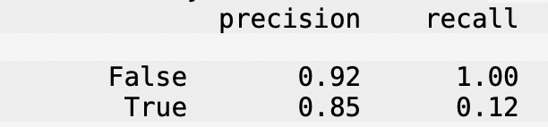

# The Musical Meaning of Explicitness

**By Abhinav Krishna**

---

## Introduction
 
This project explores a dataset of Spotify tracks, each described by musical features such as
energy, danceability, tempo, loudness, and key, alongside metadata like popularity, genre, and
whether the track is marked explicit.
 
**Central question: Can we predict whether a song is explicit based on its musical features
alone — and is explicitness reflected in a track's underlying sound (e.g. its energy)?**
 
This matters because it gets at something intuitive but rarely tested rigorously: do explicit
lyrics *sound* different, or is explicitness purely a lyrical/content label independent of the
music itself?
 
The dataset contains 89740 tracks. The columns most
relevant to this analysis are:
 
| Column | Description |
|---|---|
| `explicit` | Whether the track contains explicit content (the variable we're ultimately predicting) |
| `energy` | Perceptual intensity and activity (0–1); fast, loud, noisy tracks score high |
| `danceability` | How suitable the track is for dancing (0–1) |
| `loudness` | Overall loudness in decibels |
| `valence` | Musical positiveness (0–1); high = happy/cheerful, low = sad/angry |
| `tempo` | Estimated beats per minute |
| `key` | Musical key of the track (0=C, 1=C#, ..., 11=B) |
| `mode` | Major (1) or minor (0) key |
| `time_signature` | Estimated beats per measure |
| `track_genre` | Genre label, as tagged by Spotify |
 
---
 
## Data Cleaning and Exploratory Data Analysis
 
### Cleaning steps
 
- Dropped the `Unnamed: 0` index column, which carried no information.
- Removed a single corrupted row (`track_id == '1kR4gIb7nGxHPI3D2ifs59'`) that had missing
  `artists`/`album_name`/`track_name` and a `duration_ms` of 0 — clearly a blank/broken record
  rather than a real track.
- Deduplicated by `track_id`, keeping the first occurrence. Many tracks in the raw data appear
  multiple times because the same physical track is cross-tagged under several genres; since this
  project treats each track as a single observation rather than analyzing genre-level rows, this
  collapsing was appropriate.
- Replaced sentinel values that don't represent real musical measurements with `NaN`:
  - `key == -1` (Spotify's own "no key detected" code)
  - `tempo == 0` (a track cannot have 0 BPM)
  - `time_signature == 0` (not a valid time signature)
These steps reflect the data generating process: Spotify's audio-feature pipeline algorithmically
estimates these values, and each sentinel marks a case where that estimation failed rather than a
true "zero" measurement.
 
Cleaned data preview:

| track_id               | artists                | album_name                                             | track_name                 |   popularity |   duration_ms | release_date   | explicit   |   danceability |   energy |   key |   loudness |   mode |   speechiness |   acousticness |   instrumentalness |   liveness |   valence |   tempo |   time_signature | track_genre   |   duration_min |
|:-----------------------|:-----------------------|:-------------------------------------------------------|:---------------------------|-------------:|--------------:|:---------------|:-----------|---------------:|---------:|------:|-----------:|-------:|--------------:|---------------:|-------------------:|-----------:|----------:|--------:|-----------------:|:--------------|---------------:|
| 5SuOikwiRyPMVoIQDJUgSV | Gen Hoshino            | Comedy                                                 | Comedy                     |           73 |        230666 | 1974           | False      |          0.676 |   0.461  |     1 |     -6.746 |      0 |        0.143  |         0.0322 |           1.01e-06 |     0.358  |     0.715 |  87.917 |                4 | acoustic      |        3.84443 |
| 4qPNDBW1i3p13qLCt0Ki3A | Ben Woodward           | Ghost (Acoustic)                                       | Ghost - Acoustic           |           55 |        149610 | 1995-04        | False      |          0.42  |   0.166  |     1 |    -17.235 |      1 |        0.0763 |         0.924  |           5.56e-06 |     0.101  |     0.267 |  77.489 |                4 | acoustic      |        2.4935  |
| 1iJBSr7s7jYXzM8EGcbK5b | Ingrid Michaelson;ZAYN | To Begin Again                                         | To Begin Again             |           57 |        210826 | 1973           | False      |          0.438 |   0.359  |     0 |     -9.734 |      1 |        0.0557 |         0.21   |           0        |     0.117  |     0.12  |  76.332 |                4 | acoustic      |        3.51377 |
| 6lfxq3CG4xtTiEg7opyCyx | Kina Grannis           | Crazy Rich Asians (Original Motion Picture Soundtrack) | Can't Help Falling In Love |           71 |        201933 | 2018-08-10     | False      |          0.266 |   0.0596 |     0 |    -18.515 |      1 |        0.0363 |         0.905  |           7.07e-05 |     0.132  |     0.143 | 181.74  |                3 | acoustic      |        3.36555 |
| 5vjLSffimiIP26QG5WcN2K | Chord Overstreet       | Hold On                                                | Hold On                    |           82 |        198853 | 2017-02-03     | False      |          0.618 |   0.443  |     2 |     -9.681 |      1 |        0.0526 |         0.469  |           0        |     0.0829 |     0.167 | nan     |                4 | acoustic      |        3.31422 |

 

### Univariate Analysis
 
<iframe
  src="assets/trackenergy.html"
  width="800"
  height="600"
  frameborder="0"
></iframe>
Energy increases fairly steadily across its range rather than peaking at a single typical value,
suggesting the dataset is skewed toward higher-energy songs. This could be an artifact of the
genres present being mostly those that tend to be high energy.
 
### Bivariate Analysis
 
<iframe
  src="assets/energyexplicit.html"
  width="800"
  height="600"
  frameborder="0"
></iframe>
The percentage of explicit tracks generally rises with energy, consistent with the hypothesis test
result below, but there is a dip when energy reaches around 0.7, perhaps implying that genres
around that energy level tend to be less explicit. The last column spike could be explain by two 
factors: either one, the percent is unreliable since as we saw with the energy bins, there is a 
sudden drop in population size so the percent can fluctuate wildly, or two, it's flooded with a 
genre that's high-energy and tends to be explicit, such as heavy metal. Analyzing the genres in this
last bin, we find that 4 out of the 5 are metal subgenres, which would explain the explicitness.
 
### Interesting Aggregates
 
Grouping numeric features by `explicit` status:

|   popularity |   duration_ms |   danceability |   energy |   loudness |     mode |   speechiness |   acousticness |   instrumentalness |   liveness |   valence |   tempo |
|-------------:|--------------:|---------------:|---------:|-----------:|---------:|--------------:|---------------:|-------------------:|-----------:|----------:|--------:|
|      32.8526 |        231407 |       0.555717 | 0.62654  |   -8.67348 | 0.641962 |     0.0760494 |       0.337772 |          0.184538  |   0.214503 |  0.469693 | 123.36  |
|      36.8856 |        205050 |       0.630846 | 0.718776 |   -6.64095 | 0.583853 |     0.20876   |       0.22726  |          0.0549742 |   0.243254 |  0.46715  | 122.047 |

 
Explicit tracks average higher energy, danceability, and speechiness, and lower acousticness and
instrumentalness than non-explicit tracks, consistent with explicit content skewing toward more
produced, vocal-forward, higher-intensity music.
 
---
 
## Assessment of Missingness

Analyzing missigness, we find only tempo and time signature to be missing values, with around
19.8% percent of the tracks missing tempo and 0.181% of the tracks missing time signature.

### MNAR Analysis
 
I believe neither of these to be MNAR. The missingness is likely attributed to ambient noise and
fluctuations in tempo that make it tough for Spotify to algorithmically compute this values,
which don't necessarily change with respect to the values of tempo or time signature themselves; rather,
they would change with other features like genre.
 
### Missingness Dependency
 
I tested whether the missingness of `tempo` depends on other columns using permutation tests with
Total Variation Distance (TVD) as the test statistic for categorical columns.
 
- **`tempo` missingness *depends on* `track_genre`**: observed TVD ≈ 0.19, p-value = 0.0. This
  makes sense — some genres (e.g. ambient, spoken-word-heavy genres) are inherently harder for a
  beat-tracker to analyze than others.
- **`tempo` missingness *does not depend on* `popularity`**:
  p-value = `0.946`, indicating no detectable relationship — consistent with this column being
  unrelated to the audio-analysis pipeline that produces tempo estimates.
I ran the same pair of tests for `time_signature` missingness:
 
- **Depends on `track_genre`**: observed TVD ≈ 0.46, p-value = 0.0. For likely the same reasons as above.
- **Does not depend on `mode`**: p-value = 0.207. No reason for a major or minor key to influence missigness of time signature.
We see the results of the hypothesis test below:
<iframe
  src="assets/missingpermtest.html"
  width="800"
  height="600"
  frameborder="0"
></iframe>
---
 
## Hypothesis Testing
 
**Question:** Are explicit tracks more energetic on average than non-explicit tracks?
 
- **Null Hypothesis:** Explicit tracks are as energetic, on average, as non-explicit tracks; any
  observed difference is due to random chance.
- **Alternative Hypothesis:** Explicit tracks are more energetic, on average, than non-explicit
  tracks.
- **Test statistic:** mean(`energy` \| explicit) − mean(`energy` \| non-explicit)
- **Significance level:** 0.05
Using a permutation test (10,000 shuffles of the `explicit` label), the observed difference in
means was **0.092**, and **0 out of 10,000** permuted differences were as extreme, giving a
**p-value of 0.0**.
 
**Conclusion:** We reject the null hypothesis. This dataset provides strong evidence that explicit
tracks tend to be more energetic than non-explicit tracks. (As with any statistical test, this
doesn't *prove* the relationship — it means the observed gap is very unlikely to have arisen from
random chance alone under the null model.)
 
Interestingly, when this same test was repeated within just the hip-hop genre, the relationship
reversed: more energetic hip-hop tracks were actually *less* likely to be explicit, suggesting the
overall pattern is not uniform across genres and may partly reflect which genres tend to be
explicit in the first place, rather than a universal property of "explicit music."
 
---
 
## Framing a Prediction Problem
 
**Prediction problem:** Can we predict whether a track is explicit, based on its musical features
(key, mode, danceability, energy, loudness, valence, tempo, time signature)?
 
- **Type:** Classification (binary — explicit vs. not explicit)
- **Response variable:** `explicit`. I chose this because it's the central question motivating the
  whole project: whether explicitness is reflected in a track's sound.
- **Features used are all knowable at "time of prediction"**: all are Spotify's own
  algorithmically-derived audio features, generated from the track's audio at ingestion — none of
  them depend on post-release information like `popularity`, so there's no risk of leaking
  future/outcome information into the model.
- **Evaluation metric:**: Accuracy, mainly chose for ease of interpretability; however, it comes with
  the cost that accuracy will seem high even for a poor model(a model that predicts non-explicit every time
  would score fairly high), so have to take this into account when analyzing results.
---
 
## Baseline Model
 
**Features:** `key` (nominal), `mode` (nominal), `danceability` (quantitative), `energy`
(quantitative).
 
`key` and `mode` were one-hot encoded since they're categorical (key has no meaningful numeric
ordering; mode is a binary category). `danceability` and `energy` were left as-is since they're
already bounded, continuous quantitative measures. All steps were implemented in a single
`sklearn` `Pipeline`.
 
**Performance:** Accuracy = `0.8598` (accuracy on untrained test data, 20% of the data set aside.)
 
This is frankly a pathetic model, since it fails to beat a simple algorithm that predicts non-explicit
every time(which would achieve an accuracy of 0.914), however, it gives us a good baseline to start with.
It helps us contextualize why we need to take the extra care and steps that we do in the final model.
 
---
 
## Final Model
 
**Model:** Random Forest Classifier (chosen over the baseline's Decision Tree because ensembling
many trees reduces the overfitting risk of a single deep tree, which is a decision tree's main
weakness).
 
**New engineered features (in addition to the baseline's 4):**
 
1. **`time_signature`, one-hot encoded** — even though it's stored numerically, time signature is
   categorical in nature (3/4/5 beats-per-measure aren't meaningfully ordered or additive), so
   encoding it as a category rather than a raw number avoids implying a false numeric relationship.
2. **`tempo`, median-imputed then quantile-transformed** — tempo has missing values that needed 
   imputing, and is right-skewed with some extreme outliers; `QuantileTransformer` maps it to a 
   uniform distribution so extreme tempo values don't disproportionately influence the model.
`loudness` and `valence` were added as additional plain quantitative features.
 
These features help us get more context on the music, so we can better address the framing question;
the goal is to simply feed as much of this information as possible and see if that can create an 
effective model. We ignore features like instrumentalness or speechiness since these have much more
obvious correlations with explicitness(a song can't be explicit if it has no words), and as such stray
away from getting us an answer. These were able to improve the model since they gave a deeper understanding
of the music behind each track.

**Hyperparameters tuned:** `max_depth`, `n_estimators`, and `min_samples_split`, selected via
`GridSearchCV` with 5-fold cross-validation. These were chosen because tree depth and minimum
samples per split most directly control overfitting — a decision tree/forest's key weakness — while
the number of estimators controls how stable the ensemble's averaged predictions are.
 
**Best hyperparameters:** `max depth of None, number of estimators set to 200, and min samples split set to 2`
 
**Performance:** Accuracy = `0.9240`, compared to the baseline's `0.8598` — an improvement
(once evaluated on the same held-out test set).

Below we see a matrix describing the performance of the final model:

The low recall and high precision for explicit tracks implies this model is essentially a more refined 
version of the "guess not explicit every time model", in the sense that it rarely predicts a track to 
be explicit, but does so when it feels extremely confident.
---
 
## Fairness Analysis
 
**Question:** Does the final model perform differently for hip-hop tracks versus dancehall tracks?
I chose this pair because earlier hypothesis testing revealed that the energy–explicitness
relationship behaves differently within hip-hop than in the dataset overall, making it an
interesting candidate for a fairness check.
 
- **Group X:** hip-hop tracks
- **Group Y:** dancehall tracks
- **Evaluation metric:** Precision
- **Null Hypothesis:** The model's precision is roughly the same for hip-hop and dancehall tracks;
  any difference is due to random chance.
- **Alternative Hypothesis:** The model's precision for hip-hop tracks is higher than for
  dancehall tracks.
- **Test statistic:** precision(hip-hop) − precision(dancehall)
- **Significance level:** 0.05
Observed hip-hop precision was 0.957 vs. dancehall's 0.857 (difference ≈ 0.099). A permutation
test (1,000 shuffles) gave a **p-value of 0.152**.
 
**Conclusion:** Since 0.152 > 0.05, we fail to reject the null hypothesis — there isn't strong
evidence that the model treats hip-hop and dancehall tracks differently in terms of precision, at
least by this test. (Note: hip-hop's overall accuracy on this model was notably lower — 0.807 —
than the model's global accuracy, suggesting that while precision parity holds, the model's
ability to correctly classify hip-hop tracks overall may still be weaker than for the dataset as a
whole. However, since the proportion of hip-hop tracks that are explicit is 0.313, a simple model
predicting not explicit every time would only have an accuracy of 0.687, demonstrating our model's
advantage over this simple version.)